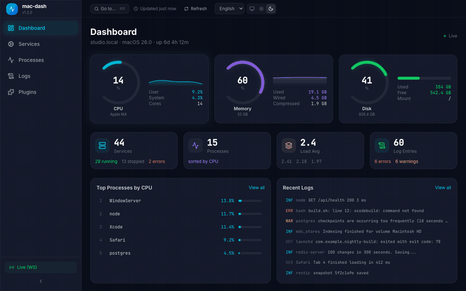
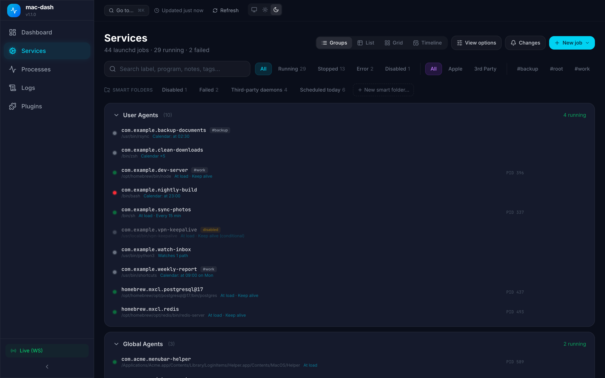
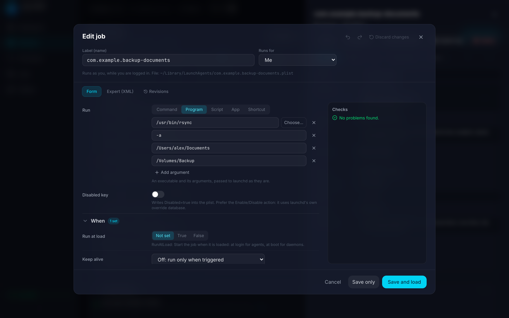
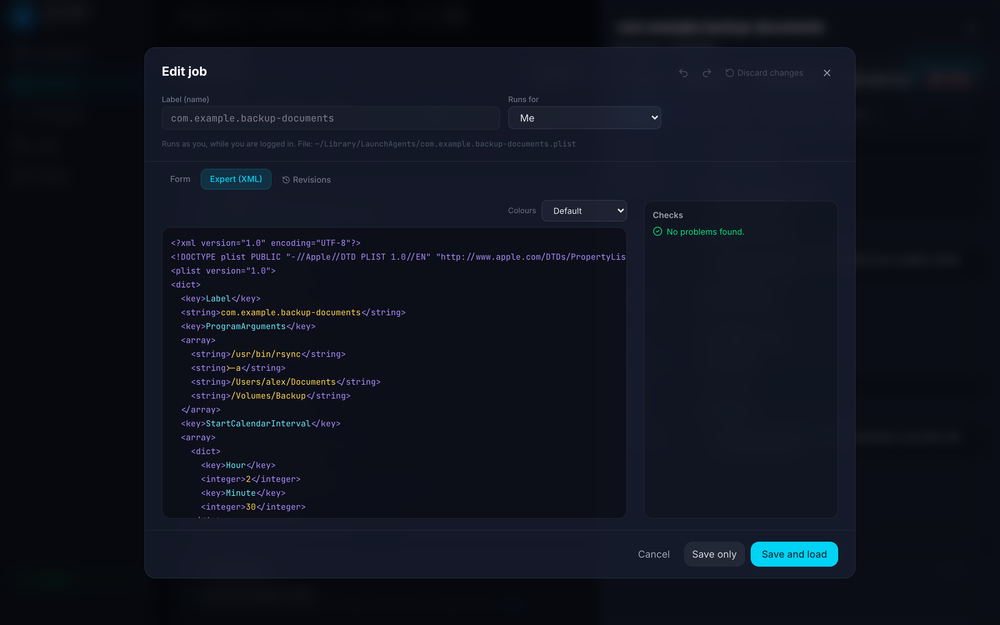
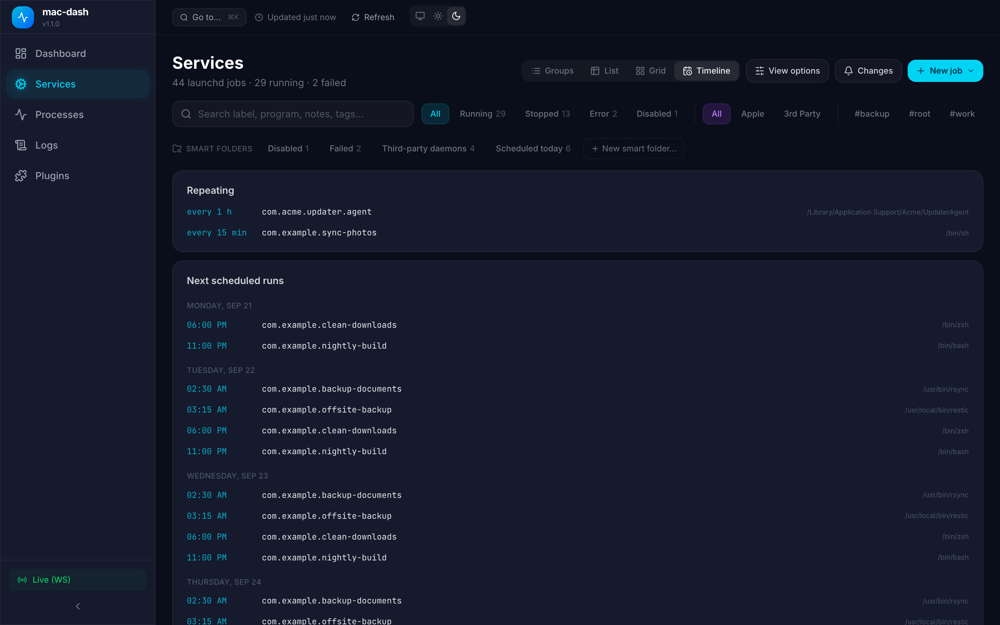
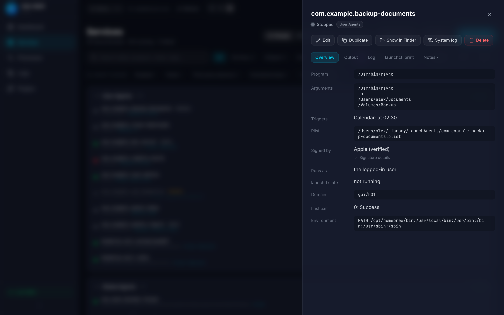
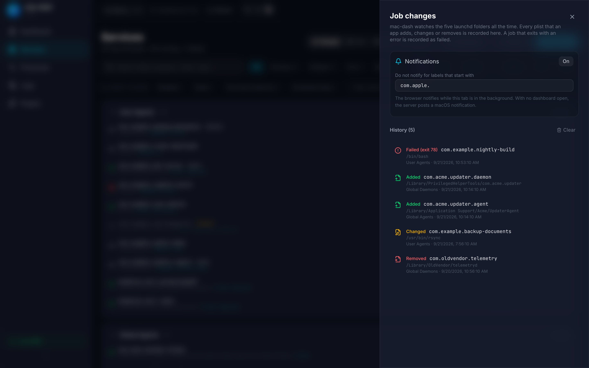
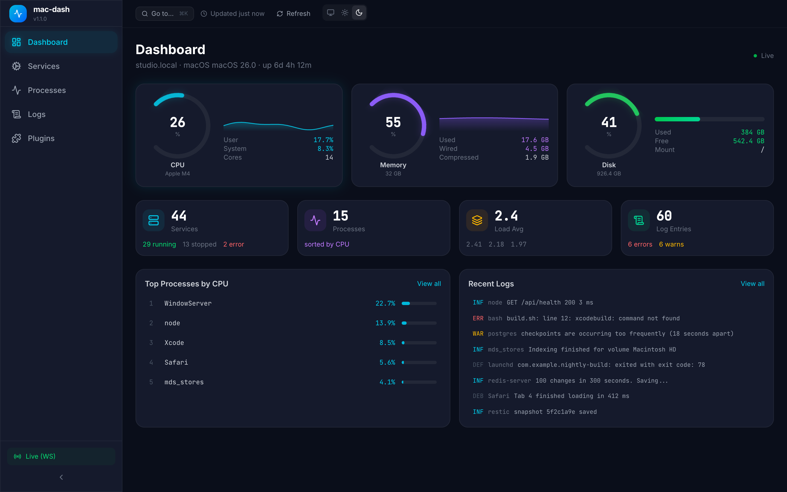
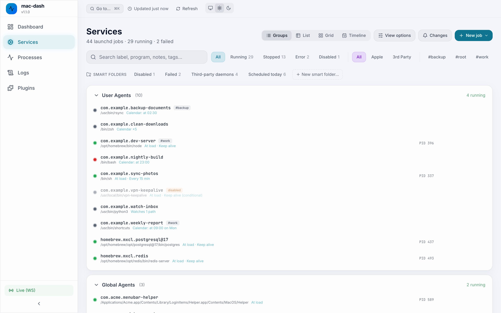

<p align="center">
  <br />
  <strong style="font-size: 48px;">🖥️</strong>
  <br />
</p>

<h1 align="center">mac-dash</h1>

<p align="center">
  <strong>See, create and edit every launchd job on your Mac</strong><br />
  Plus processes, logs and system load. Open source, as a desktop app or in your browser.
</p>

<p align="center">
  <a href="https://github.com/talhaorak/mac-dash/actions/workflows/ci.yml"></a>
  <a href="https://www.npmjs.com/package/@talhaorak/mac-dash"></a>
  <a href="https://www.npmjs.com/package/@talhaorak/mac-dash"></a>
  <a href="https://github.com/talhaorak/mac-dash/blob/master/LICENSE"></a>
  <a href="https://github.com/talhaorak/mac-dash/stargazers"></a>
</p>

<p align="center">
  <a href="https://talhaorak.github.io/mac-dash">Website</a> &middot;
  <a href="#installation">Install</a> &middot;
  <a href="#features">Features</a> &middot;
  <a href="CONTRIBUTING.md">Contributing</a> &middot;
  <a href="https://buymeacoffee.com/talhao">Sponsor</a>
</p>

<p align="center">
  
</p>

---

## What is mac-dash?

mac-dash is a launchd job manager and system dashboard for macOS:

- **Create and edit** LaunchAgents and LaunchDaemons: a form for every `launchd.plist` key, an XML expert mode, checks, templates, revisions
- **Watch** the launchd folders: a history and a notification when any app adds, changes or removes a job, or when a job starts to fail
- **Verify** who runs on your Mac: code signatures, login items, background items, privileged helper tools
- **Monitor** CPU, memory and disk, **explore** processes, **stream** the unified log
- **Extend** with plugins

| | |
| --- | --- |
|  |  |
|  |  |
|  |  |
|  |  |

The screenshots use fictional data. `bun run media` regenerates them.

Available as both a **native desktop app** (Tauri) and a **web server** (Bun + Hono). Desktop app uses native macOS APIs — no HTTP server, no Node.js, minimal overhead.

## Installation

### Desktop App 🖥️ (Recommended)

The native macOS desktop app uses Tauri — no server needed, native APIs, minimal resource usage.

**Homebrew:**
```bash
brew install --cask talhaorak/tap/macdash
```

**Manual Download:**
Download the latest `.dmg` from [GitHub Releases](https://github.com/talhaorak/mac-dash/releases) and drag to Applications.

> ✨ **Benefits:** Native performance, no server, menu bar integration, auto-update support

---

### CLI / Web Server

For the web-based version with plugin support:

**Quick Start (npx):**
```bash
npx macdash
```

**Global Install (npm):**
```bash
npm install -g @talhaorak/mac-dash
macdash
```

**Homebrew:**
```bash
brew install talhaorak/tap/macdash
macdash
```

**From Source:**
```bash
git clone https://github.com/talhaorak/mac-dash.git
cd mac-dash
bun install
cd client && bun install && cd ..
bun run dev
```

> **Requirements**: macOS + [Bun](https://bun.sh) runtime

## Features

### System Dashboard
Real-time CPU, memory, and disk monitoring with animated gauges, sparkline charts, and hardware info.

### Service Manager and launchd job editor
Browse all LaunchAgents and LaunchDaemons across user, global, and system directories, with the live state of both launchd domains. Run, stop, restart, enable, or disable a job.

Create and edit jobs like in Lingon:

- A form for every documented `launchd.plist` key: command, script, app or Shortcut to run, run at load, keep alive with conditions, intervals, calendar schedules, watch paths, environment, output files, user, resource limits.
- Expert mode with the raw XML, syntax colours and parse errors with line numbers.
- Checks before you save: missing executables, `~` in paths, keys that only apply to daemons, schedules launchd would ignore.
- Jobs for you, for all users, or as root. Saving to `/Library` asks for an administrator password.
- Templates, duplicate, show in Finder, delete to the Trash, revisions with revert, notes and tags, a timeline of the next runs.
- Output tab for the job's stdout and stderr, `launchctl print`, and an explanation of the last exit status.
- A monitor that watches the five launchd folders all the time. It notifies you and keeps a history when any app adds, changes or removes a job, and when a job starts to fail.
- The verified code signature of every job's executable: Apple, Developer ID with team, ad-hoc or unsigned.
- Smart folders, a sortable list view, and a quick switcher (Cmd+K).
- Login items, the macOS background-items database, crontab, privileged helper tools, and the repeating wake and sleep schedule in the same place.

[docs/lingon-parity.md](docs/lingon-parity.md) lists every Lingon feature and its status.

### Process Explorer
View running processes sorted by CPU or memory. See detailed command arguments. Kill processes when needed.

### Log Viewer
Stream macOS unified logs in real-time via WebSocket. Filter by log level (error, warning, info, debug) or by process name.

### Plugin System
Extend mac-dash with custom plugins that add new pages, API endpoints, and dashboard widgets.

```
plugins/
  my-plugin/
    manifest.json   # Plugin metadata
    server.ts       # Backend API routes
    client.tsx      # React UI component
```

See [plugins/README.md](plugins/README.md) for the full plugin development guide.

## Usage

```bash
# Start with default port (7227)
macdash

# Custom port
macdash --port 8080

# Or use environment variable
PORT=8080 macdash
```

Then open [http://localhost:7227](http://localhost:7227) in your browser.

### Security

mac-dash can kill processes and install launchd jobs, and it has no login. The server therefore listens on `127.0.0.1` only and rejects requests from other web pages (Origin check) and from rebound DNS names (Host check).

| Variable | Effect |
| --- | --- |
| `HOST` | Listen address. Default `127.0.0.1`. `0.0.0.0` exposes the API to your network: only do this behind an authenticating reverse proxy. |
| `MACDASH_ALLOWED_HOSTS` | Extra `Host` names to accept, comma separated. |
| `MACDASH_ALLOWED_ORIGINS` | Extra origins to accept, comma separated, e.g. `https://dash.example.com`. |
| `MACDASH_ROOT` | Folder that holds `plugins/` and `dist/client/` when they are not next to the binary. |

### Run as Background Service

Install mac-dash as a LaunchAgent that starts on login:

```bash
./scripts/install-launchagent.sh
```

## Tech Stack

| Layer | Technology |
|-------|-----------|
| Runtime | [Bun](https://bun.sh) |
| Server | [Hono](https://hono.dev) |
| Frontend | [React 19](https://react.dev) |
| Styling | [Tailwind CSS 4](https://tailwindcss.com) |
| Bundler | [Vite](https://vite.dev) |
| Real-time | WebSocket |
| State | [Zustand](https://zustand.docs.pmnd.rs/) |
| Charts | Dependency-free SVG sparklines |

## Project Structure

```
mac-dash/
  server/              # Bun + Hono backend
    core/              # System info, launchctl, process manager, log reader
    routes/            # REST API endpoints
    ws/                # WebSocket hub with topic-based subscriptions
    plugins/           # Plugin registry
  client/              # React + Vite + Tailwind frontend
    src/
      components/      # UI components (Gauge, MiniChart, GlowCard, etc.)
      pages/           # Dashboard, Services, Processes, Logs, Plugins
      hooks/           # Custom hooks (useWebSocket)
      stores/          # Zustand state stores
      lib/             # API client, utilities
  plugins/             # Plugin directory
  website/             # Landing page (GitHub Pages)
  scripts/             # Helper scripts
```

## Contributing

We welcome contributions! Please see our [Contributing Guide](CONTRIBUTING.md) for details.

- [Code of Conduct](CODE_OF_CONDUCT.md)
- [Security Policy](SECURITY.md)

## Support

If you find mac-dash useful, consider supporting the project:

<a href="https://buymeacoffee.com/talhao" target="_blank"></a>

## Author

**Talha Orak** — Software Architect

- GitHub: [@talhaorak](https://github.com/talhaorak)
- Website: [talhaorak.github.io/mac-dash](https://talhaorak.github.io/mac-dash)

## License

[MIT](LICENSE) &copy; Talha Orak
